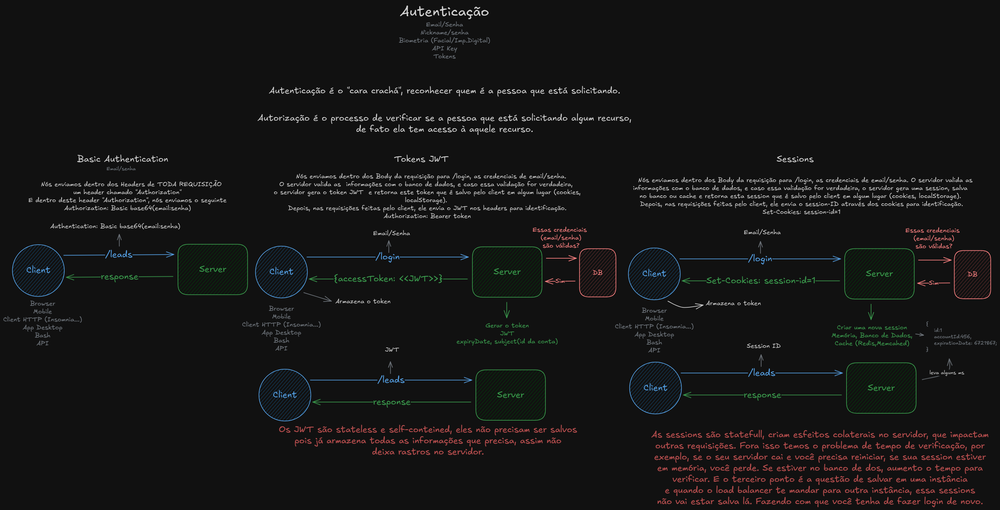

# 🔐 JWT Authentication in Node.js APIs

 🧩 This project was developed as part of the **JWT Authentication in Node.js APIs** live from the [JStack](https://jstack.com.br/) course. The goal is to build an API implementing a complete JWT authentication flow, while exploring the differences between *authentication* and *authorization*.
 Throughout the project, we cover authentication using *Basic Auth, JWT Tokens* and *sessions*. The API includes *sign-in* and *sign-up* flows using [`jsonwebtoken`](https://www.npmjs.com/package/jsonwebtoken) library.
 We also apply concepts from `Clean Architecture` and `SOLID principles`, especially **SRP (Single Responsability Principle)** and **DIP (Dependency Inversion Principle)**, organizing the application into well-defined layers. Additionally, we incorporate software design patterns such as the `Factory` and `Adapter` patterns to enhance flexibility and maintainability.

## 🎯 Objectives

 - Understand how to implement *JWT authentication* in Node.js APIs
 - Differentiate betweem *Authentication* and *Authorization*
 - Learn how to use *Basic Authentication, JWT tokens,* and *sessions*
 - Implement secure *sign-in* and *sign-up* flows using the `jsonwebtoken` library
 - Apply *Clean Architecture* principles to organize application layers
 - Put innto pratice *SOLID principles*, especially SRP and DIP
 - Explore and apply design patterns like *Factory* and *Adapter*

## 📘 Explanation in Brazilian Portuguese (pt-BR)

The image below summarizes the keys concepts covered in the lesson about athentication types. All the content is explained in Brazilian Portuguese (pt-BR), making it easier to understand for native speakers.


## 📄 Technologies Used

 - **Node.js**
 - **TypeScript**
 - **Express**
 - **jsonwebtoken**
 - **Prisma ORM**
 - **Zod**

## ⚙️ Getting Started

### Prerequisites
Make sure you have the following installed:
 - **Node.js** (v18 or above)
 - **npm**, **Yarn** or **pnpm**
 - **Docker**

### Installation
Clone the repository:
```
git clone https://github.com/labs-jstack/jwt-authenticate-node-api.git
cd jwt-authenticate-node-api
```

Install the dependecies:
```
npm install
# or
yarn install
# or
pnpm install
```

Start the containers (e.g., PostgreSQL) with Docker:
```
docker-compose up -d
```

Run the Prisma migrations to set up the database schema:
```
npx prisma migrate dev
```

To run the project locally:
```
npm run dev
# or
yarn dev
# or
pnpm dev
```

## Contributing
🤝 Feel free to open issues, suggest improvements or submit pull requests to help improve the project!

## License

📝 This project is licensed under the [MIT licensed](https://github.com/nestjs/nest/blob/master/LICENSE).

## Contact
✉️ Developed by João Henrique Fernandes.

[](https://www.linkedin.com/in/joaohenriquefernandes/)
[](https://github.com/joaohenriquefernandes)
